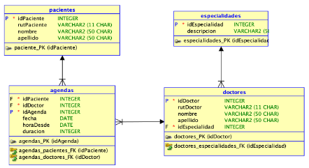

# awakelab-ensayo-vacunas

## Problema
La Clínica “El Vacunazo” necesita llevar el control de las horas médicas que se solicitan a diario. Para ello, usted deberá desarrollar una solución que, basada en el modelo de datos descrito a continuación, satisfaga los requerimientos planteados más adelante.

El modelo de datos utilizado es el siguiente:

Considerando el modelo descrito, desarrolle una solución utilizando Spring Framework MVC que considere funcionalidad que se detalla a continuación.

## Solución

### Requerimientos Funcionales

#### Listado de Horas Reservadas

 * Se requiere menú para ingresar tanto al listado, como a la realización de una nueva reserva.
 * Listado de Nombre, Apellido y Rut del paciente.
 * Listado del Nombre y apellido del especialista.
 * Listado de Especialidad a la que corresponde el especialista.
 * Fecha de la reserva.
 * Hora de la reserva.
 * Acciones de Editar y Borrar la reserva. Solicite confirmación antes de borrar. La opción Editar permite cambiar todos los datos de una reserva, salvo al paciente.

#### Reserva de Horas Médicas

 * Se requiere menú para ingresar tanto al listado, como a la realización de una nueva reserva.
 * La lista desplegable de especialidad se debe llenar consumiendo una API REST implementada por la misma app.
 * La lista de Doctores(as) se debe llenar de acuerdo a la especialidad  seleccionada, y consumiendo una API REST implementada por la misma app.
 * Fecha: Validar una fecha válida, y superior al día actual.
 * Hora: Validar una hora validada.

### Requerimientos No Funcionales

 * El sistema debe ser construido utilizando el framework Spring MVC, conectándose a una base de datos Oracle 11g express.
 * Debe asociar las vistas por medio de vínculos HTML.
 * En las tablas no existen campos autoincrementales.
 * La revisión del problema se realizará en base al modelo antes planteado; no se permite agregar, modificar o quitar campos del modelo.
 * Desarrolle un sitio con al menos 2 vistas.
